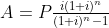
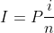
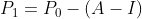

# Formulas

## Amortization

A = periodic payment amount  
P = principal  
i = periodic interest rate  
n = total number of payments  

_ex: 10 year loan for $100,000 at 5% interest_  
P = $100,000  
i = 5%  
n = 120 (10 years of monthly payments)  

## Interest

How to calculate interest vs principal payments:

I = interest payment  
P = current principal  
i = interest rate  
n = number of payments per year  

## Principal

P1 = new principal  
P0 = current principal  
A = repayment amount  
I = interest payment  

## Full Example

What is the payment schedule for a $100,000 loan at a 5% interest rate that is paid back monthly over 10 years?  

| month | Current Principal | Repayment | Interest Paid | Principal Paid | New Principal |
|-------|-------------------|-----------|---------------|----------------|---------------|
|     1 |          $100,000 |      $833 |       $416.66 |        $416.34 |    $99,583.66 |
....
